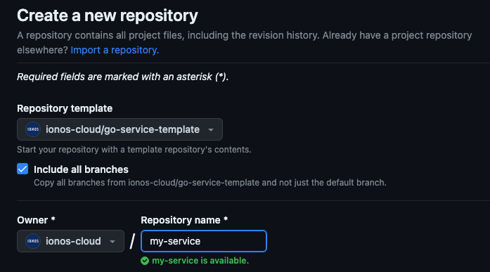

[//]: # (TOTOUCH: Add your own meaningful and well written README.)

# IONOS Cloud Go Service Template

GitHub template to kickstart a new non customer facing Go service for IONOS Cloud.

For customer facing services please use the (not yet existing) `Go API Service Template`.

## Getting Started

### TL;DR

Create a new repository from this template that includes all branches
and visit all places marked with `TOTOUCH` in the code and follow the instructions!

### Step by Step

1. Create a new repository from this template that includes all branches of the template:
   
2. Clone repository and checkout the `feat/service-api` branch
3. Add your repository to
   the [PaaS-SRE Renovate configuration](https://github.com/ionos-cloud/paas-sre-renovate/blob/master/config.js#L25)
4. Place the Vault access credentials as a GitHub secret in your repository
   named `VAULT_ROLE_ID` and `VAULT_SECRET_ID` - If you don't have them see
   the [Vault Configuration](https://confluence.united-internet.org/display/PAAS/Vault+Usage+in+Data+Products+Department)
   page.
5. Add the ionos-cloud GitHub token to vault adapt or matching the path in
   the [code verification workflow](.github/workflows/verify-code.yaml)
   (search for `# TOTOUCH: Place ionos-cloud GitHub token in vault and adapt path`)
6. Create a SonarCloud project add the token to vault and adapt the SonarCloud properties in
   the [sonar-project.properties](sonar-project.properties) file
7. Place the Sonar Cloud Token to vault adapt or matching the path in
   the [code verification workflow](.github/workflows/verify-code.yaml)
   (search for `# TOTOUCH: Place SonarCloud token in vault and adapt path`)
8. Configure harbor dev registry in [build workflow](.github/workflows/build-assets.yaml)
9. Place the Harbor access credentials in Vault
10. Generate a cosign key pair and place the private key and the password in Vault
11. Adapt the registry information of the [helm chart](deployments/helm/service) and
    the [verify chart workflow](.github/workflows/verify-chart.yaml)
12. For an easy local development, move the [.envrc sample file](.envrc.sample) to `.envrc` and
    adapt the values to your needs. The [`direnv` tool](https://direnv.net) might come in handy here.
13. Create a PR request - all checks should pass. Otherwise, check the TOTOUCHs again.
14. Configure the repo settings - especially the branch protection rules - to your need.
    For inspiration see
    the [Working with GIT](https://github.com/ionos-cloud/kaas-documentation/blob/main/adr/adr_0010_working-with-git.md)
    documentation.
15. Create or adapt your own API spec and implement it.

**Happy coding!**
